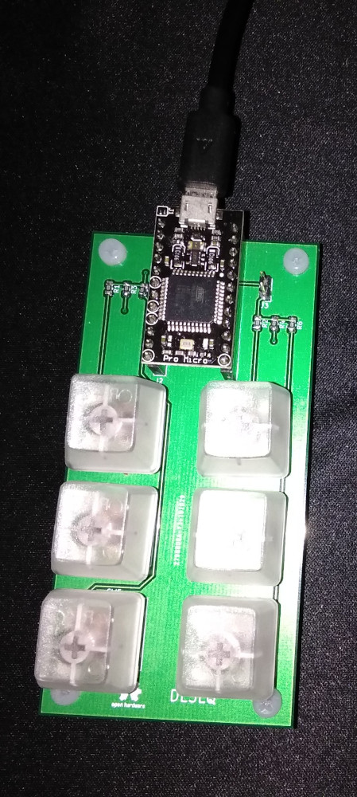

# MediaKeys

| 1  | 2 |
| ------------- | ------------- |
| Play/Pause | Stop  |
| Previous | Next |
| Volume - | Volume + |

The Arduino sketch requires the [Arduino HID Project](https://github.com/NicoHood/HID) (installable from the Arduino IDE)
